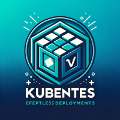

# Kubernetes Cluster Deployment on VirtualBox VMs using Vagrant and Ansible



This repository is designed to set up a Kubernetes cluster on multiple VirtualBox virtual machines using Vagrant and Ansible.

## Requirements (tested with these versions)

- VirtualBox version 6.0 or higher
- Vagrant version 2.3.7
- Python version ^3.0
- Poetry version 1.5.1

## Getting Started

1. Clone the repository:

    ```bash
    git clone git@github.com:nshybeka-super/k8s_cluster_maintain.git
    cd k8s_cluster_maintain
    ```

2. Install dependencies using Poetry:

    ```bash
    poetry install
    ```

3. Activate the Poetry environment:

    ```bash
    poetry shell
    ```

4. Run the script to set up the environment:

    ```bash
    source ./post_install.sh
    ```

    This script runs post-installation tasks necessary for this project. For instance, it installs Ansible collections and roles.

5. After completing these steps, you will be ready to deploy a Kubernetes cluster on VirtualBox VMs using Vagrant and Ansible using vargant up

        vagrant up

## Note!

Ensure that you have all the listed dependencies installed and that the software versions meet the project's requirements.

**Note:** This repository is currently under development and is not fully functional yet.